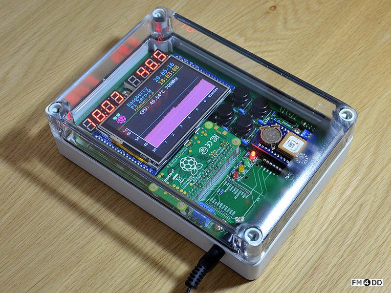
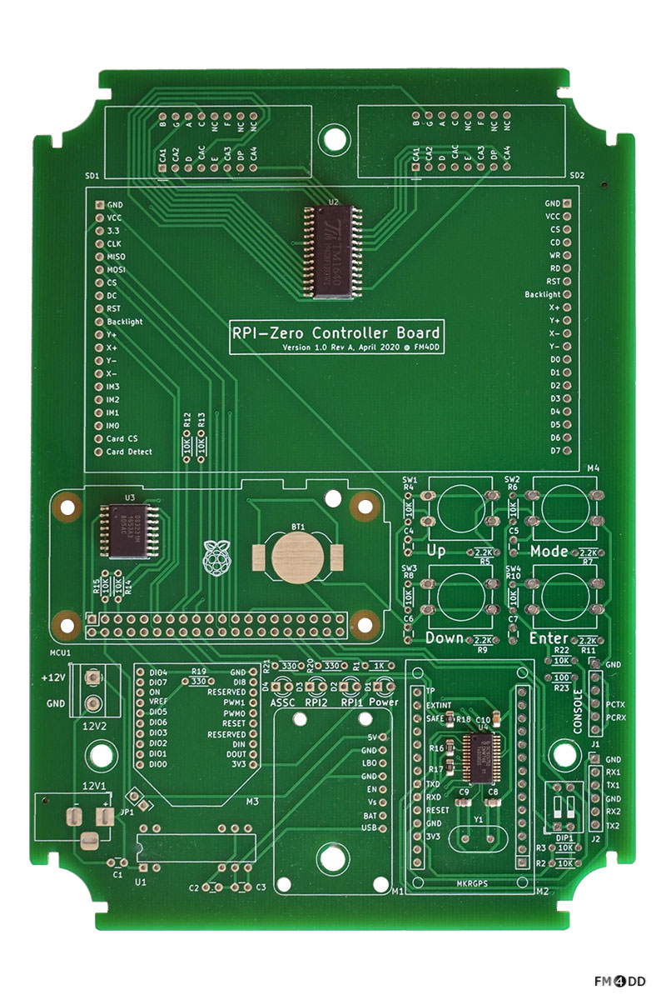
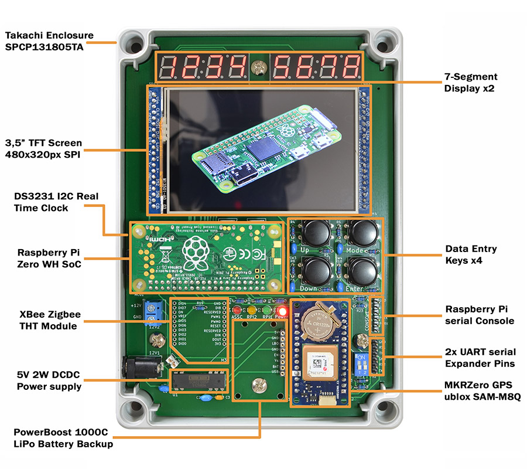
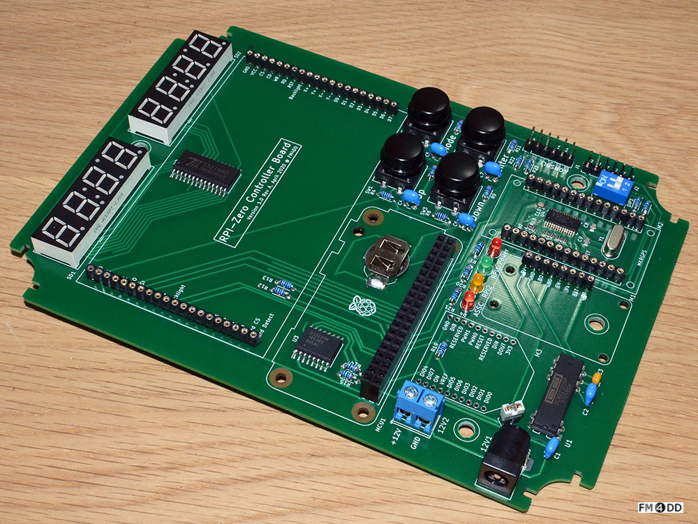

## PiCon-One

### Description

PiCon-One is a multi-function controller for automation and industrial use cases.
At its heart is the smallest member of the Raspberry family, the Raspberry Pi Zero W.
Instead of adding a "hat" on top of the Raspberry, I reversed the roles:
The Pi becomes the "hat" for the controller mainboard, which has been fitted to 
a Takachi enclosure.

The design aims to add flexible power configuration, real-time clock, GPS positioning,
display and communication interfaces, enabling rapid prototyping under the widespread
Raspberry Pi ecosystem.

### Schematic
[PiCon-One Schematics](picon-one-schematics-v10a.pdf)

### PCB Gerber

Layers: 2
Dimension: 118mm x 168mm
PCB Thickness: 1.6
PCB Color: Green
Surface Finish: LeadFree HASL-RoHS
Copper Weight: 1
Material: FR4-Standard Tg 130-140C
Gerber: [PiCon-One Gerber V1.0a](picon-one-gerber-v10a.zip)

### Components Layout

Takachi Enclosure: SPCP131805T, 125mm x 175mm x 50mm

### Bill of Materials

[BOM file PiCon-One v1.0a](./picon-one-bom-v10a.csv)

### Assembly

SMT parts assembly has been combined with PCB manufacturing. 
Remaining is the THT parts assembly.

#### Software and Drivers

Example software and setup is kept in a separate github repo at
https://github.com/fm4dd/picon-one-sw

### License

CERN Open Hardware Licence v1.2
